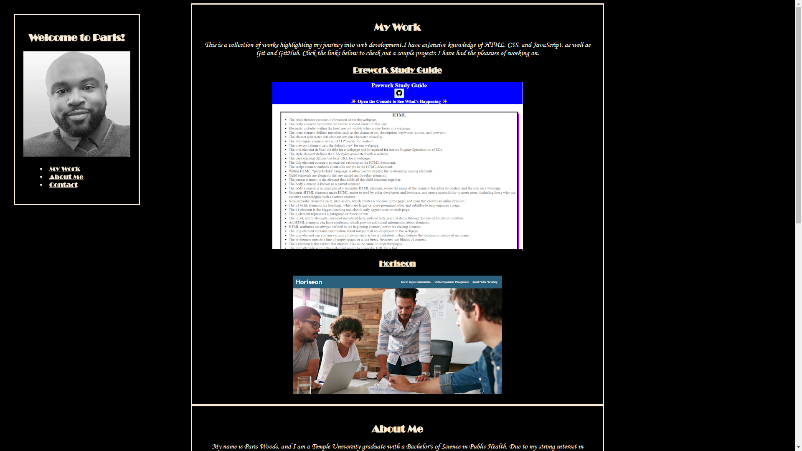

# Welcome-to-Paris
A portfolio of young man's journey into Web Development. 

## Description
Throughout this portfolio application, users will learn about Paris Woods an aspiring Web Developer. They will also be able to view samples of his work, and contact information.

### Usage
Depending on the width of the screen, the navigation menu will either follow the user throughout the page or position itself along the top of page. Click on the one of the links within the navigation menu to be taken to that section of the application. As the user examines the works provided, they can click on the name of the work or the screenshot to be taken that speciific application's deployed link. 

